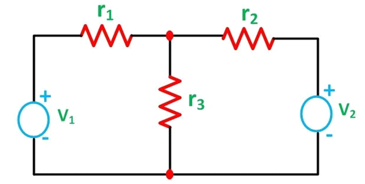
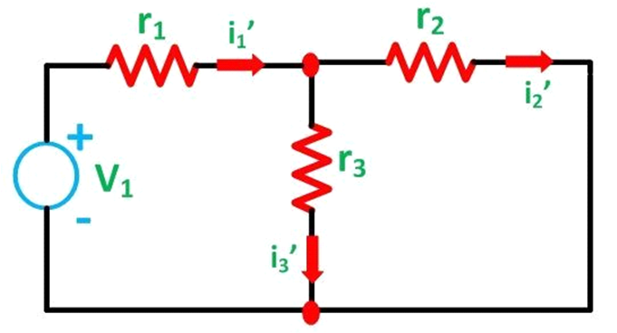
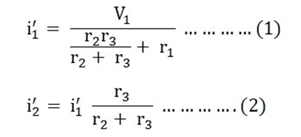
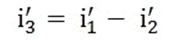
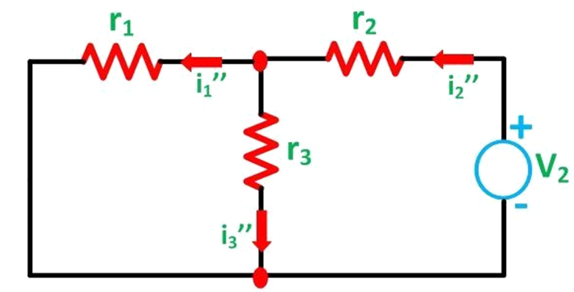
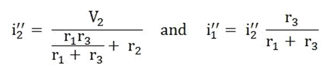
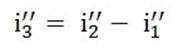
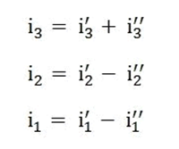

Let us understand the superposition theorem with the help of an example. The circuit diagram is shown below consists of two voltage sources V1 and V2.

<!--   -->
 
 
First, take the source V1 alone and short circuit the V2 source as shown in the circuit diagram below:
<!--   -->
 

Here, the value of current flowing in each branch, i.e. i1', i2' and i3' is calculated by the following equations.
<!--  -->
 

 
The difference between the above two equations gives the value of the current i3'.
<!--  -->
 

 
Now, activating the voltage source V2 and deactivating the voltage source V1 by short-circuiting it, find the various currents, i.e. i1'', i2'', i3'' flowing in the circuit diagram shown below

<!--  -->
 

 
Here,

<!--  -->
 

 
And the value of the current i3'' will be calculated by the equation shown below:

<!--  -->
 

 
As per the superposition theorem, the value of current i1, i2, i3 is now calculated as:

<!--  -->
 

 

The direction of the current should be taken care of while finding the current in the various branches.
