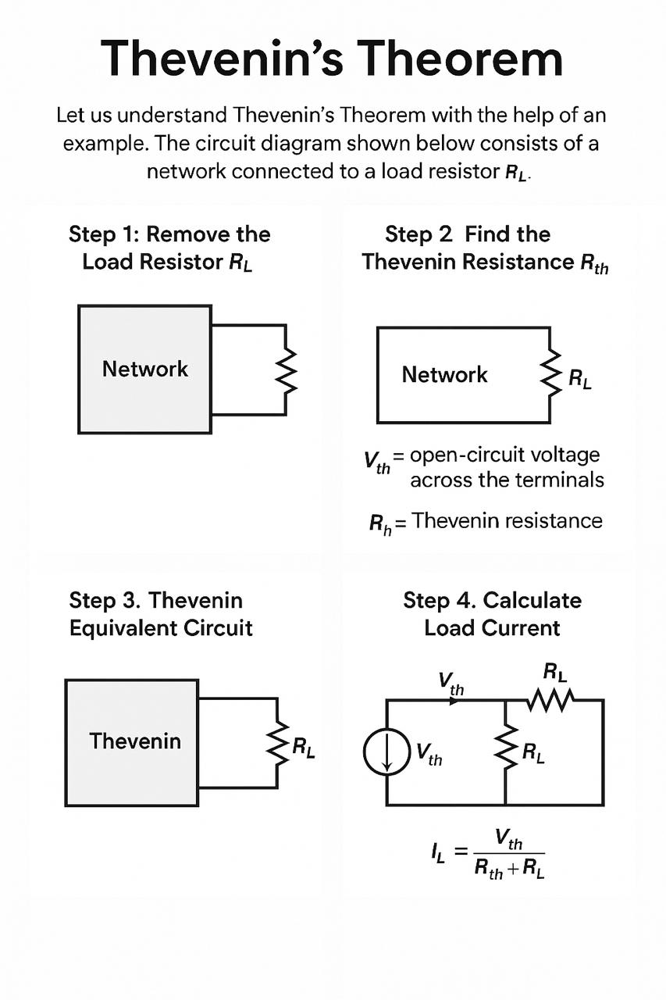

Let us understand Thevenin’s Theorem with the help of an example. The circuit diagram shown below consists of a network connected to a load resistor RL.

Step 1: Remove the Load Resistor RL

The open-circuit voltage across these terminals is known as Vth, calculated using standard circuit analysis techniques.

Step 2: Find the Thevenin Resistance Rth
Now deactivate all independent sources:

Replace voltage sources with a short circuit.

Replace current sources with an open circuit.

Then, calculate the equivalent resistance across the open terminals. This resistance is called Rth.

Step 3: Thevenin Equivalent Circuit
Now construct the Thevenin equivalent circuit using the calculated values of Vth and Rth. Connect the load resistor RL back to this simplified circuit.

Step 4: Calculate Load Current
The load current IL flowing through RL can be calculated using Ohm’s Law:

Where:

Vth = Thevenin Voltage

Rth = Thevenin Resistance

RL = Load Resistance

Conclusion:
Thevenin’s Theorem allows you to simplify a complex circuit into a simple two-component equivalent, making analysis easier—especially when studying the effect of varying the load resistor RL.

Let us understand the superposition theorem with the help of an example. The circuit diagram is shown below consists of two voltage sources V1 and V2.

 <!--  -->
 
 
First, take the source V1 alone and short circuit the V2 source as shown in the circuit diagram below:
<!--   -->
 

Here, the value of current flowing in each branch, i.e. i1', i2' and i3' is calculated by the following equations.
<!--  -->
 

 
The difference between the above two equations gives the value of the current i3'.
<!--  -->
 i₃′ = i₁′ − i₂′......(3)
 
Now, activating the voltage source V2 and deactivating the voltage source V1 by short-circuiting it, find the various currents, i.e. i1'', i2'', i3'' flowing in the circuit diagram shown below

<!--  -->
 

 
Here,

<!--  -->
 i₂″ = V₂ / [(r₁·r₃) / (r₁ + r₃) + r₂] ———(4)  and   i₁″ = i₂″ · (r₃ / (r₁ + r₃))———-(5)

 
And the value of the current i3'' will be calculated by the equation shown below:

<!--  -->
 i₃″ = i₂″ − i₁″———(6)

 
As per the superposition theorem, the value of current i1, i2, i3 is now calculated as:

<!--  -->
i₃ = i₃′ + i₃″ ——(7)
i₂ = i₂′ − i₂″——(8)
i₁ = i₁′ − i₁″———(9)

 

The direction of the current should be taken care of while finding the current in the various branches.
